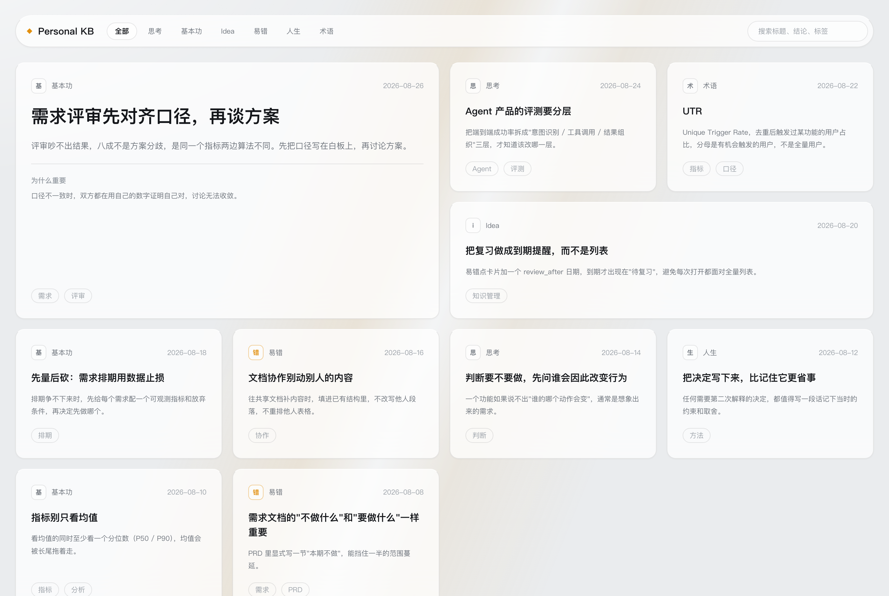

# 作品集

这里收录了一些产品、设计与技术实践。每个作品都有一份介绍和一个能直接点开的在线 demo。

## 作品

### [TokenLens](./tokenlens/README.md)

面向个人开发者的 AI 成本仪表盘。统一展示不同 AI 编程工具的使用成本，定位浪费，并通过优化编排和预算管理把成本压下来。

[在线 demo](https://rebecia.github.io/rebekah-s-home/tokenlens/) · [作品介绍](./tokenlens/README.md) · [产品调研与决策](./tokenlens/产品调研与决策.md)

### [Personal KB 卡片墙](./personal-kb-vscode/README.md)

把对话里沉淀下来的知识，变成能翻、能数、能复习的卡片。一个 VS Code / Comate 插件：读本地 Markdown 卡片，渲染成卡片墙，统计分类分布，并把同一份文件连到 Obsidian。

[在线 demo](https://rebecia.github.io/rebekah-s-home/personal-kb-vscode/docs/demo/) · [作品介绍](./personal-kb-vscode/README.md) · [使用手册](./personal-kb-vscode/docs/USAGE.md)

<!--
新增作品时复制以下内容：

### [作品名称](./项目目录/README.md)

用一两句话说清作品的用途和价值。

[在线 demo](https://rebecia.github.io/rebekah-s-home/项目目录/) · [作品介绍](./项目目录/README.md)

-->
