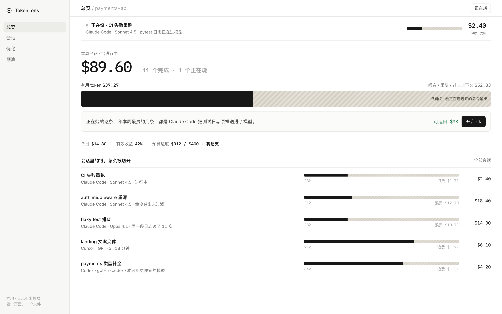
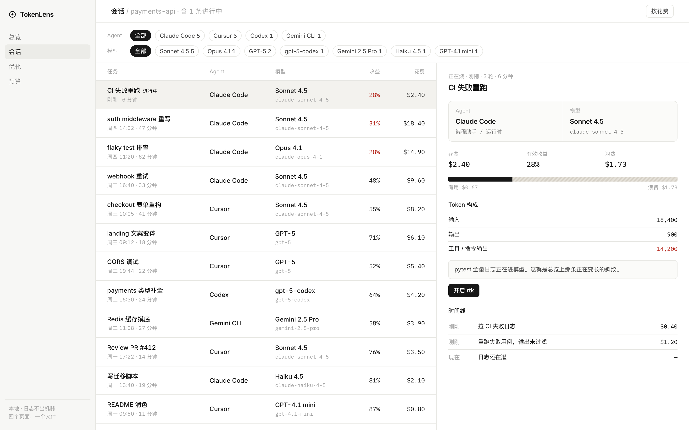
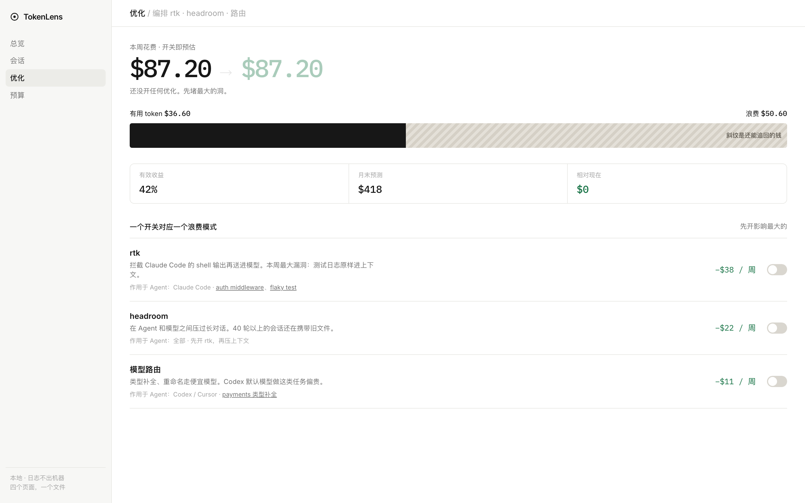
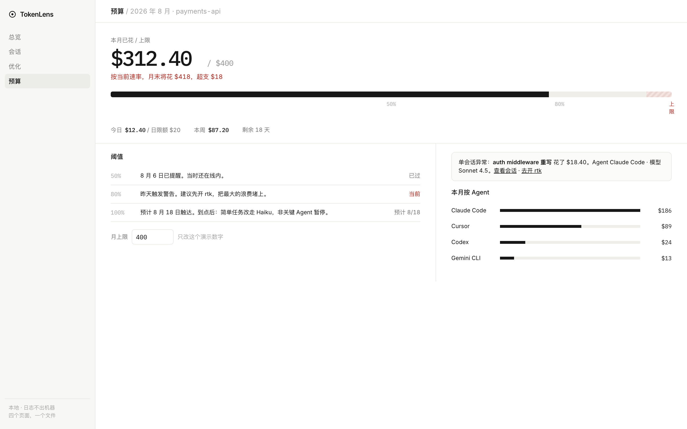

# TokenLens

**看清 AI 花了多少钱、花在哪，以及怎么省。**

[打开可交互原型](./index.html) · [产品调研与决策](./产品调研与决策.md) · [返回作品集](../README.md)

## 这是什么

TokenLens 是一个面向独立开发者、自由职业者和小团队技术负责人的 AI 使用成本可视化与优化工具。

它统一追踪 Claude Code、Cursor、Codex、Gemini CLI 等 AI 编程工具的本地使用记录，让用户知道钱花在了哪个项目、Agent、模型和会话上；同时识别其中的浪费，并把对应的优化动作直接接到分析结果上。

它不只是一个账单仪表盘，更像 AI 编程工具旁边的“成本副驾”。

## 它解决什么问题

使用多个 AI 编程工具时，开发者通常会遇到三件事：

1. **看不全**：订阅和 API 消耗分散在不同平台，很难得到统一账目。
2. **看不懂**：知道总花费，却不知道哪段上下文、哪次工具输出造成了浪费。
3. **改不了**：追踪工具只展示问题，压缩工具只提供能力，两者没有形成闭环。

TokenLens 把这条路径连起来：

> 看见成本 → 找到浪费 → 开启优化 → 验证结果

## 核心作用

| 能力 | TokenLens 做什么 |
| --- | --- |
| 统一成本视图 | 按项目、Agent、模型和会话拆分 AI 花费。 |
| 浪费分析 | 把 token 切成“有用 / 浪费”，定位重复上下文、冗长命令输出等问题。 |
| 优化编排 | 根据浪费类型推荐并配置 rtk、headroom 或模型路由。 |
| 预算守卫 | 设置月度预算、预测月末花费，并在超支前给出干预建议。 |
| 效果验证 | 对比优化前后的成本，让省下的钱可以被明确看见。 |

## 主要页面

### 总览：先看钱花在哪里

总览页展示本周花费、正在消耗成本的会话，以及有用 token 和浪费 token 的比例。用户可以从异常花费直接进入对应会话。

### 会话：定位具体浪费

会话页把 Agent 和实际计费模型分开统计，并展示单次任务的成本、有效收益、token 构成和执行时间线。

### 优化：把建议变成动作

针对命令输出冗余、上下文过长和模型选型过贵三类问题，TokenLens 提供对应的优化开关，并立即反馈预计节省金额。

### 预算：在超支之前干预

预算页结合当前消耗速度预测月末花费，并通过提醒、优化建议和模型降级策略控制风险。

## 产品边界

TokenLens 专注个人开发者的本地成本管理，因此明确不做：

- 团队权限、审批和多租户管理
- API 网关或模型代理服务
- 自研 token 压缩算法
- 替代 Claude Code、Cursor 等 AI 编程工具

它负责发现、编排和验证，具体优化能力尽量复用成熟工具。

## 当前产出

- 可直接在浏览器打开的交互原型
- 总览、会话、优化、预算四个关键页面
- 从用户问题、竞品分析到 MVP 范围的产品决策
- 对“看见 → 切开 → 修复 → 证明”核心闭环的交互验证

## 如何体验

直接打开 [TokenLens 交互原型](./index.html)。这是一个单文件前端原型，不需要安装依赖或运行构建命令。

产品背后的竞品分析和范围取舍见 [产品调研与决策](./产品调研与决策.md)。

---

[← 返回作品集](../README.md)
